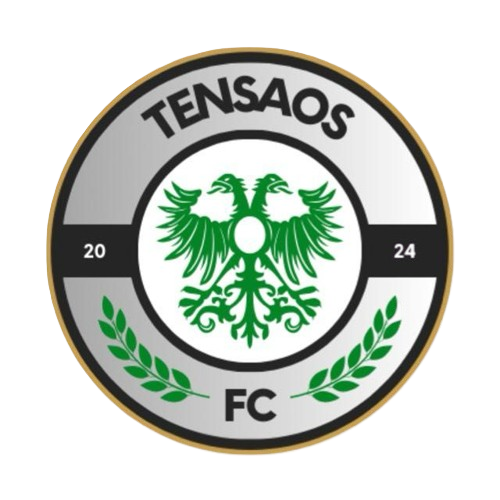
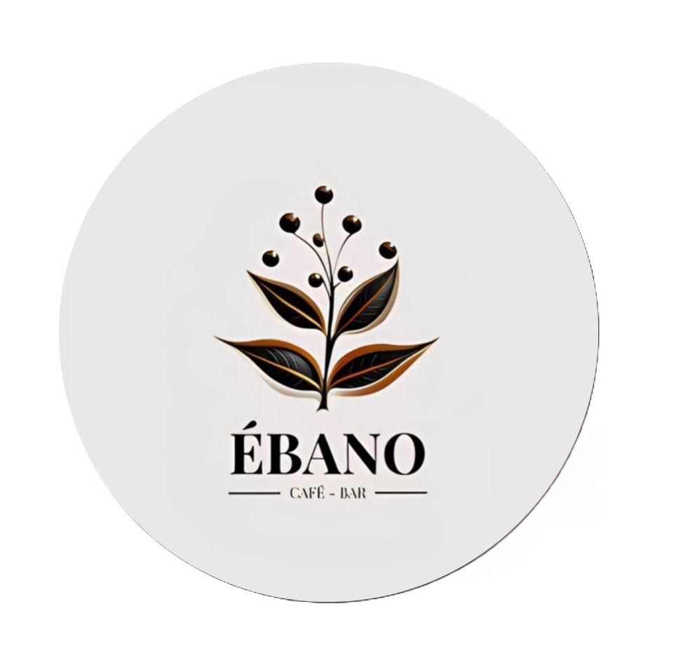
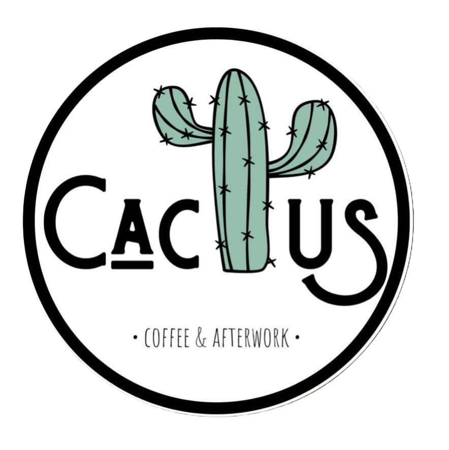

<h1>Tensaos FC Website</h1>

<h2>Descripción</h2>

Tensaos FC es la plataforma oficial del club de fútbol que recopila su historia, perfil de jugadores, patrocinadores y últimas noticias.

<h2>Características clave</h2>
<ul>
  <li>Jugadores: perfiles detallados con imagen, datos y redes sociales</li>
  <li>Partidos: calendario, resultados y estadísticas</li>
  <li>Sobre nosotros: historia del club, misión y valores</li>
  <li>Patrocinadores: logos interactivos con enlace a su web</li>
  <li>Modo claro/oscuro: experiencia adaptable a preferencias del usuario</li>
  <li>SEO & performance: optimizado para carga rápida y posicionamiento</li>
</ul>

<h2>Desarrollo</h2>

Desarrollada con Astro y Tailwind CSS, garantiza rendimiento óptimo, accesibilidad y diseño responsive.

<h2>Despliegue</h2>
<ul>
  <li>Netlify (Free services)</li>
  <li>Despliegue continuo</li>
</ul>

<h2>Licencias & derechos</h2>
<ul>
  <li>Plantilla: AstroPlate by Zeon Studio (MIT License). Ver LICENSE.</li>
  <li>Contenido propio © 2025 DiegoLangreo7 / Tensaos FC. Todos los derechos reservados.</li>
  <li>Imágenes de patrocinadores y fotografías de jugadores usados con permiso.</li>
</ul>

<h2>Contacto</h2>
<ul>
  <li>Club: <a href="https://www.instagram.com/tensaos_fc/">@tensaos_fc</a></li>
  <li>DevOps: <a href="https://github.com/DiegoLangreo7">DiegoLangreo7</a></li>
</ul>

<h2>Patrocinadores</h2>

|  |  |  |
|--------------------------------------|-----------------------------------|-------------------------------------|

